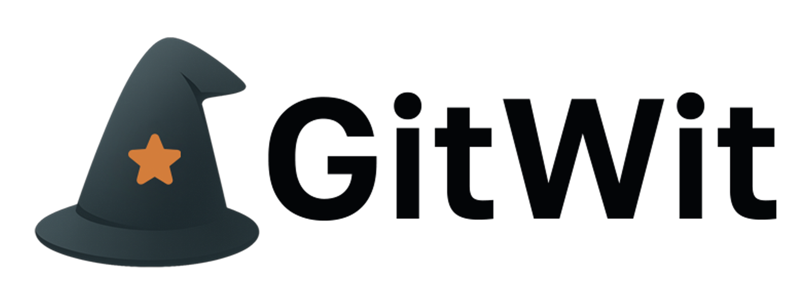

<p align="center">
  <picture>
    
  </picture>
</p>

---

## 🧰 Status & Ecosystem

<p align="center">

  <!-- CI Status -->
  <a href="https://github.com/rafandoo/gitwit/actions/workflows/deploy.yml">
    
  </a>
  <a href="https://github.com/rafandoo/gitwit/actions/workflows/docs.yml">
    
  </a>

  <!-- Releases -->
  <a href="https://github.com/rafandoo/gitwit/releases">
    
  </a>

  <!-- Code Quality -->
  <a href="https://app.codecov.io/gh/rafandoo/gitwit">
    
  </a>

</p>

## 📝 Project description

<p align="justify">
GitWit is a lightweight CLI tool designed to help developers craft better commit messages following semantic conventions. 
It provides interactive assistance (wizards), linting, and changelog generation, ensuring consistent, meaningful, and 
standardized commit history across projects. 
</p>

## 🤔 Problem definition

<p align="justify">
Writing clear, consistent, and structured commit messages can be challenging, especially in teams or open-source projects. 
GitWit addresses this by enforcing a configurable set of rules, guiding users either through an interactive wizard or 
automatic validation, reducing noise and improving project traceability.
</p>

## 🛠️ Technologies used

<p align="center">
    
    
</p>

## 📦 Installation & Usage

### 📦 For git projects

GitWit is designed to work within projects that are version-controlled using Git.
You can use it in local repositories to:

- Create commits interactively using semantic commit conventions;
- Validate commit messages (linting);
- Generate changelogs based on commit history.

You can get the packages directly from the [Releases](https://github.com/rafandoo/gitwit/releases) page in the GitHub repository.

In the attachments for each release, you'll find:

- Linux: .deb and .rpm packages (e.g., gitwit_1.0.0.deb, gitwit_1.0.0.rpm)
- Windows: .exe installer (e.g., gitwit_1.0.0.exe)

Choose the package corresponding to your system and follow the standard installation process for your platform.

You can now run commands like:

```bash
gitwit -h              # Show help
gitwit install         # Install GitWit alias in current repository
gitwit commit          # Start interactive commit wizard
gitwit lint            # Lint latest commit
gitwit changelog       # Generate changelog for current branch
```

### 🧪 Local Development

Clone the project and build it locally:

```bash
git clone https://github.com/rafandoo/gitwit.git
cd gitwit

./gradlew clean runnableJar
```

In the `build/libs` directory, you will find the `gitwit-<version>-aio.jar` file, this is the "all in one" file that contains all the dependencies needed to run GitWit.
You can run it using:

```bash
java -jar build/libs/gitwit-<version>-aio.jar -h
```

## 🔧 Functionalities

✔️ Interactive commit wizard – Step-by-step prompt for type, scope, short & long descriptions.

✔️ Commit linting – Validate commits individually or in ranges.

✔️ Changelog generation – Group commits by type and scope.

✔️ Custom YAML configuration – Define allowed types, scopes, and validation rules.

✔️ Multilingual support – Supports English and Portuguese messages.

✔️ Git hook friendly – Can be wired into Git lifecycle manually.

✔️ Emoji support for commit types.

✔️ Windows and Linux native installers.

## 🚀 Future enhancements

✔️ Plugin support for custom lint rules.

✔️ Contribution metrics and insights.

✔️ Support for commit signing.

## License 🔑

This project is licensed under the [Apache License 2.0](https://github.com/rafandoo/gitwit/blob/f76cb4e1e145816dc2cccd60c0ae0af6157172b0/LICENSE)

Copyright :copyright: 2025-present - Rafael Camargo
